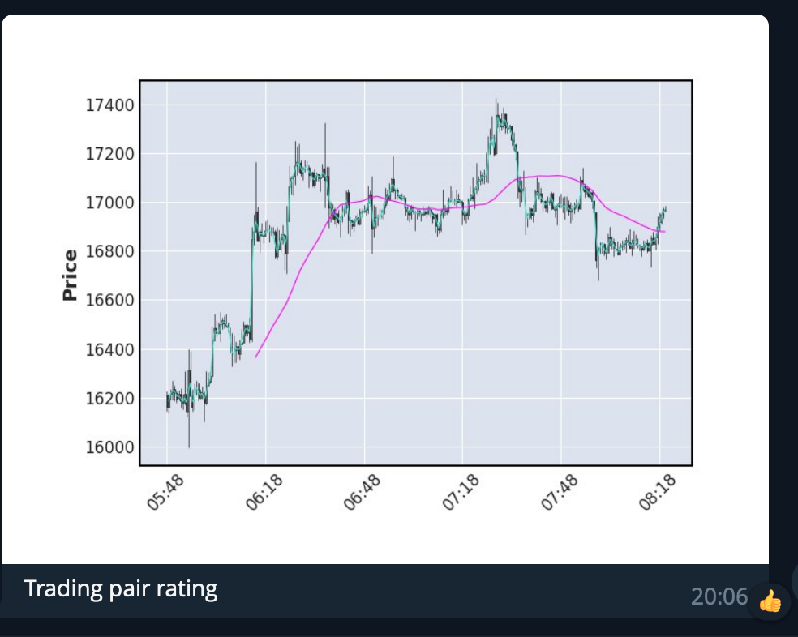

# TgBotScrap

Python3 must be already installed

```shell
git clone https://github.com/skrypka-dmytro/TgBotScrap.git
ython3 -m venv venv
source venv/bin/activate
pip install -r requirements.txt
```

## DEMO

